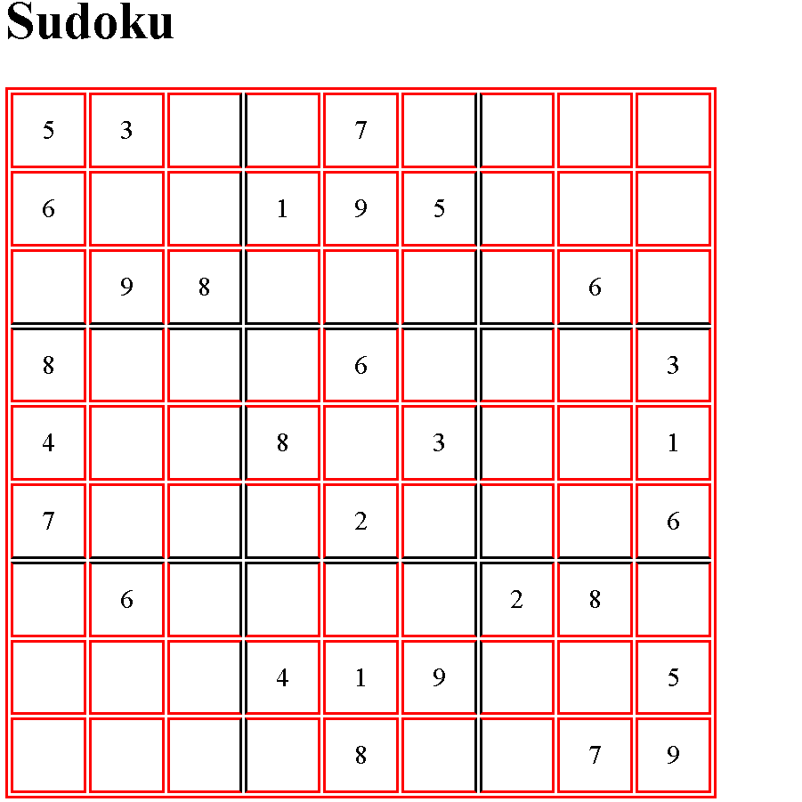

# Práctica Tablas  (Ejercicio 2) // Sudoku.

## Enunciado.

A partir de la imagen proporcionada, debes escribir tu documento `HTML` con sus estilos en `CSS`.

La imagen es la siguiente:

También debe realizar el Sudoku correctamente.

